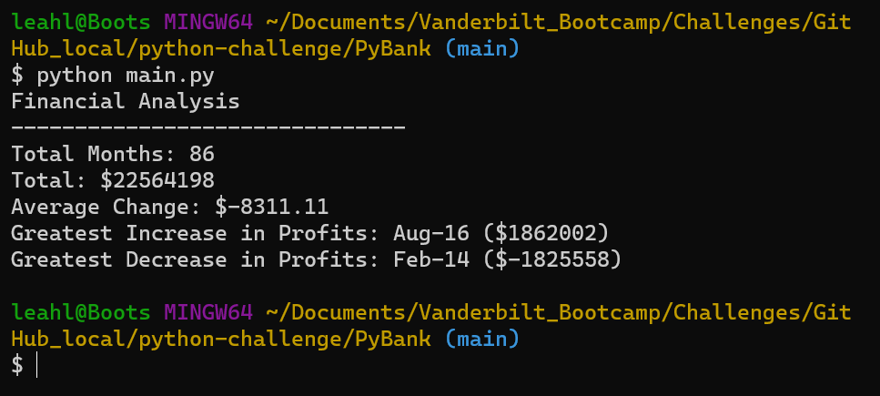
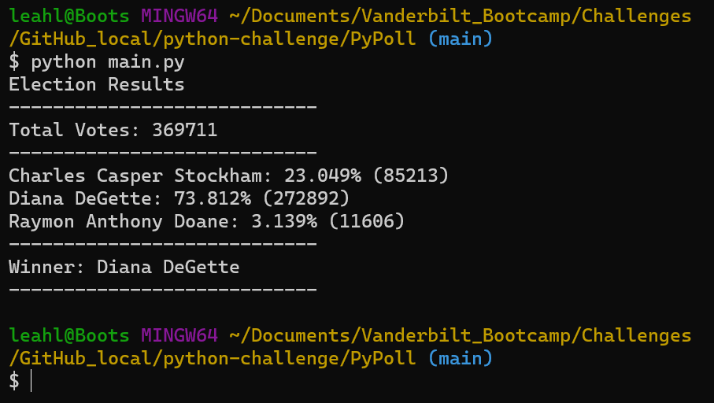

# python-challenge
Module 3 Challenge

### INCLUDED IN THIS REPOSITORY:

* PyBank folder containing:
   * analysis folder containing output .csv file
   * Resources folder containing original .csv file
   * main.py file containing python script
* PyPoll folder containing:
   * analysis folder containing output .csv file
   * Resources folder containing original .csv file
   * main.py file containing python script
* Images folder containing 2 .png files

_______________________________________________

### PyBank:

This code reads the provided csv file and computes budget data as specified in the assignment.  It uses a For Loop to calculate day-to-day changes and stores them in a list to determine average, max increase, and max decrease. It is set up with variables so it will run if additional days are added.

_______________________________________________

### PyPoll:

This code reads the provided csv file and computes election results as specified in the assignment. It also uses a For Loop to count votes for each candidate and is set up with variables so it will still run if additional candidates or ballots are added.

_______________________________________________

### REFERENCES:

* removing list duplicates reference: https://stackoverflow.com/questions/7961363/removing-duplicates-in-lists by poke / Mateen Ulhaq
* converts string list to integer: https://stackoverflow.com/questions/43769886/cant-convert-list-string-to-integer by Antimony
* methods of list objects (used throughout): https://docs.python.org/3/tutorial/datastructures.html
* fixing one character per column in write csv file: https://stackoverflow.com/questions/15129567/csv-writer-writing-each-character-of-word-in-separate-column-cell